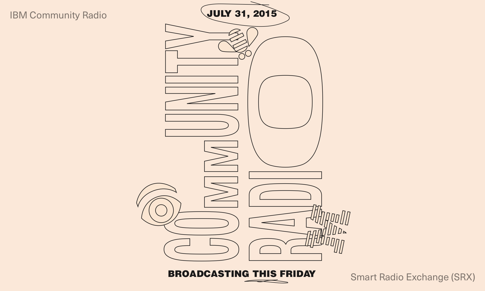
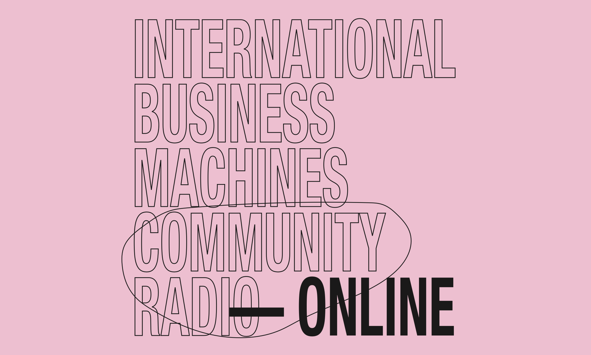
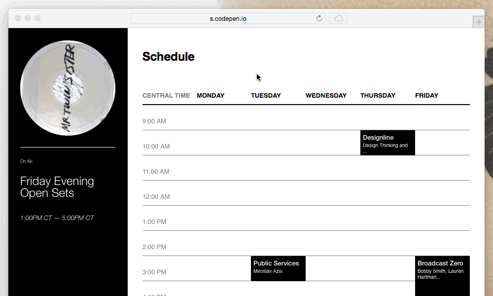

A quick demo of beta functionality as of November 1, 2015:

<iframe width="100%" height="550px" src="https://player.vimeo.com/video/144302196?loop=1&color=1565ff&title=0&byline=0&portrait=0" frameborder="0" webkitallowfullscreen mozallowfullscreen allowfullscreen></iframe>

