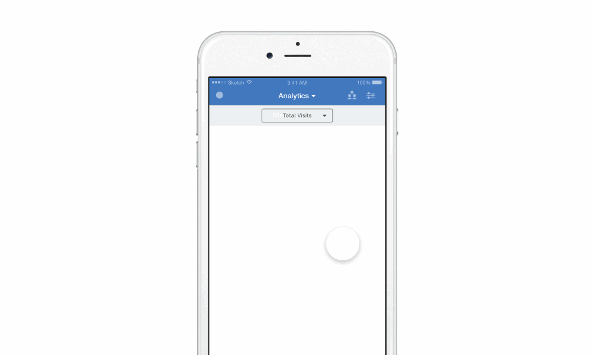
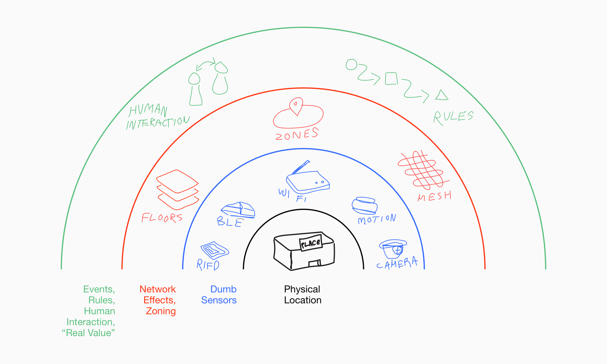
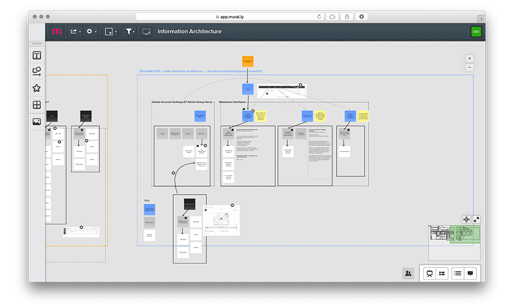

Since this project is Ongoing, and things change rapidly all the time, this page will adopt a structure of short n' snippy updates in descending (newest to oldest) order. Expect this stuff to be rather raw!

If you want to begin with the oldest updates at the bottom of this page, go [here]().

##### — Most Recently (Last week of August)

So with a good majority of my team out for vacation, things have been a little slow and I've been prototyping some mobile interfaces to accompany the changes we've delivered in the nav earlier this month. I've gone through several revisions of these, but I'm just showing a couple.

( Click on either .gif to view the Framer prototype )

The views above depict a possible interface for viewing a list of sites you manage. The one you're located within/near is placed at the top along with a preview of the site map associated with it.

This simple prototype just shows how we might adapt our nav into a mobile format.

##### — Nav and Styleguide (August 2015)

This week some huge updates to PI's navigational structure finally got pushed into the actual product. Here's a comparison of what it was like, and what it is now:

Before:

After:

Although this was a much-needed visual overhaul (that has yet to be fully implemented), there are many info-architectural edits that have yet to be applied given the wide area of effect they cover. Most of these changes regard the flattening of navigable interfaces to simplify PI's mental model (and remove unsightly nav breadcrumbs) and the consolidation and simplification of experiences that are arbitrarily broken apart.

~

PI's style guide has seen good progress and is gaining further definition under Jess (PI's visual designer) and I's eyes. At the moment, we are in the unique position of defining the overall visual language for the entirety of IBM MobileFirst's product design efforts.

No pressure right? Here's a few snapshots of our initial prototype guidelines and their application:

In IBM-speak, what Jess and I are doing is defining a ‘Dialect’ of IBM's primary [design language](https://www.ibm.com/design/language/), essentially taking the general principles outlined by the language and tailoring them to MobileFirst's portfolio — given the fluid context of working across devices inherent to a platform literally dedicated to mobile product design, a huge part of our job (as far as the style guide is concerned) is making sure experiences scale across product lines and device types.

##### — Lab Jammin' (July 2015)

Mid-July, we flew out to meet our dev team in Raleigh. It was a very rad time full of working in the same room(!), drinking after work, and getting to know the people behind the telephone lines and chat interfaces. All this alone was worth the trip.

My primary focus around this time however was to 1.) attend a technical sales workshop and absorb the nitty-gritty of PI's nuts and bolts and 2.) understand how PI resonated with our Sales team. Essentially, the format of the workshop was delineated by short conversations on various aspects of PI's technical architecture, points of integration, and future-facing capability. Between certain lectures we were treated to hands-on demos on how to set up example PI instances on Raspberry Pis installed with specially flashed SD cards, among other things. The output of our work will eventually be made available on our [public-facing Github organization](https://github.com/presence-insights).

Here's one of the small demo systems we built — it's a bit scrappy:

I was able to dive right into all of this stuff from a great vantage point as both first-time user and designer/researcher — the amount learned that I was able to relay back to my team and into the product was incredible, and there are many quick-turnaround improvements to be made.

##### — Demo Sprints (May 2015)

We took a couple weeks in May to step outside our normal sprint-to-sprint work stream and figure out some of the further-flung aspects of what PI could possibly and/or eventually do.

Along with some of the more conceptual work, we had time to finally address some of the pervasive problem areas in PI's interface design, those namely being the controls associated with data visualization, and the data visualizations themselves. Ever since we had been introduced to the product, it was very apparent that these controls needed significant polish, so it was great to finally address them around this time.

Here's a few examples of some of the horribly-constructed visualization controls:

You can see that there's literally no means of controlling the data displayed in the heatmap, and the other two place some of the crucial controls completely out of the way, and in grey on grey. These aren't just damning crops, patterns like these were seen across most of the analytics interfaces.

With the complete lack of cohesion between dataviz controls being the most glaring issue, Jess and I took to task the structuring of these controls in a modular fashion, as so:

Our primary improvement to these components resided in simply placing the controls closer to their context, retaining a sense of linear progression when selection options and making choices, and universally applying these controls to every data view. We additionally included the ability to view ‘Snapshots’ of data within our design, which extrapolated useful insights of the data in front of our users against the greater system at large.

##### — How does Site Setup Work? (April 2015)

I've been embroiled in learning in ins–and–outs of setting up physical and digital infrastructure so that a sensing mesh network can actually function properly.

I've been tailing and speaking with people representative of the “IT Operations Staff” whom typically find themselves doing the setup work for projects of this kind. It's generally very painful.

I mean, this is what our users are dealing with right now:

I have my work cut out for me!

Thanks to our brilliant architects however, I've been able to learn about the actual endpoints/connectors/etc. PI is made up of and formulate a few visual models to teach the rest of my team how all this stuff works. Here's one of the scribbles I'm most proud of:

What we're looking at here is a very simplified model of what exactly constitutes a fully-functioning Presence Insights instance. Essentially, starting from the center of the diagram, we're able to take note of what's required, and what order it might be set up in — obviously we need a physical space to gather data (insights) from first, a collection of ‘dumb’ sensing equipment second, a means of linking together or meshing or grouping these sensors into spatial zones third, and last but not least, the ability to actually derive value from the system in the form of business-logic-driven events, and people-to-people interaction.

We'd expect our primary users to manipulate interfaces dealing in the green portion of this image.

##### — Opportunities Abounding, Focus Narrowing (March 2015)

After our large bout of research and resulting synthesis, we had a huge amount of raw material for potential designing. Our research, coupled with workshops and interlocks with our design/research team in Israel, gave us a huge amount of momentum in tackling some of the larger issues at hand with PI, the primary ones being 1.) the setting up of physical sensing infrastructure, 2.) the setting up of the software, and 3.) visualizing data ingestion to make sure the system was running smoothly, and doing what it's advertised as doing.

Figuring out most of this required us to lay out the entire system and reconsider everything:

Digital boards such as the ones shown above were printed out and scribbled over, scrapped, and reconfigured many times. Some of the obvious problems we ran into quickly and identified as needing attention were rapidly prioritized.

At this time, being the designer most familiar with the technical background of Presence Insights as a system, I was given primary oversight over figuring out how to best communicate and model how site hardware/software infrastructure setup was to be accomplished. Most of the design work at this time was in the form of educational material for an entire team ramping up their knowledge into the “Proximity Services” space.

##### — Research & Development (Feburary 2015)

When asked, I often refer to this period of time working on PI as one of the best periods of conjoined design/research efforts I've ever participated in. We had full trust and support from our management, engineering team, and other closely associated stakeholders — more than I had personally witnessed at IBM thus far, in my teams and others.

With our entire design team involved in active research, we were able to split tasks accordingly and maintain a wide net of input, with each person taking on a focus for a particular type of research. At the time, I was assisting our ethnographic research efforts, gathering information from teams around our studio who had worked in similar contexts, and led our ingestion of competitor products/platforms that also operated in the Location Analytics field.

Most of the artifact-archiving and synthesis in the early stages of research occured digitally, due to the many remote teammates we needed to relay information to. We utilized [Murally](https://mural.ly/) pretty heavily at this point, and created tons of boards similar to the examples below:

Later, when our period of research was tapering off and we primarily needed to synthesize captured data like recorded interviews and ethnographic insights derived from photography/written notes, we used the nearby space and hashed out design guidelines and recommendations for future design efforts in an IRL manner:

Thanks to our extended stay in research-mode, we had a well-defined set of functional design principles we could apply towards experiences aimed at both end-use consumers and the people actually using PI day-to-day.

##### — Starting Off (January 2015)

At the moment, my job is to take this powerful (and quite ugly) research project —

— and (re)form it into a platform that empowers the people who use it to learn more about the “invisible sysyems in their surrounding environment” in a rich and pragmatic way.

Our current description of Presence Insights from a business-value perspective is as such:

> Presence Insights:
>
> “A Physical–Digital System by which a Brick & Mortar Establishment can Optimise their services/offerings/supply chain and Give tangible value back to their customers.”

Our team is currently undergoing a heavy research phase, but if you'd like to chat about what this project comprises of, I'm only a keystroke away.
