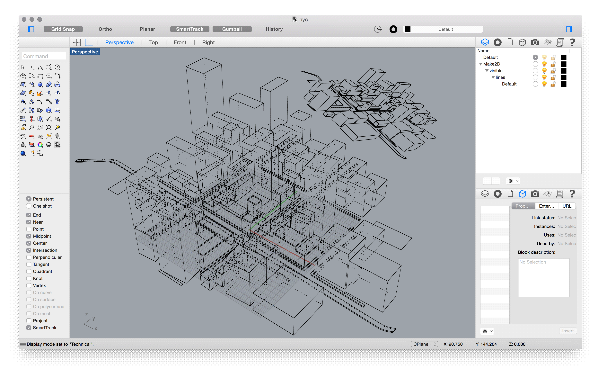
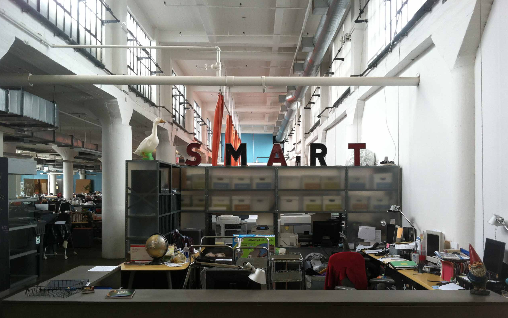
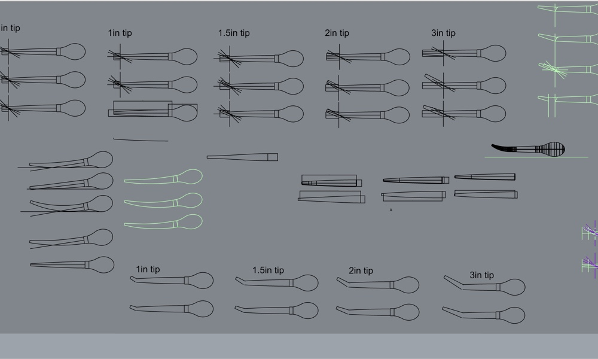
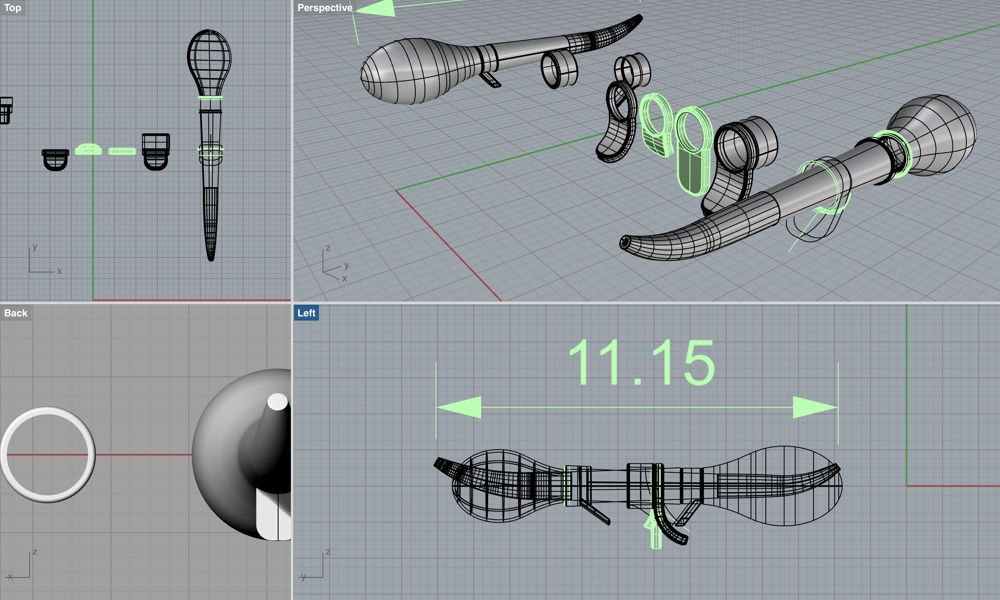
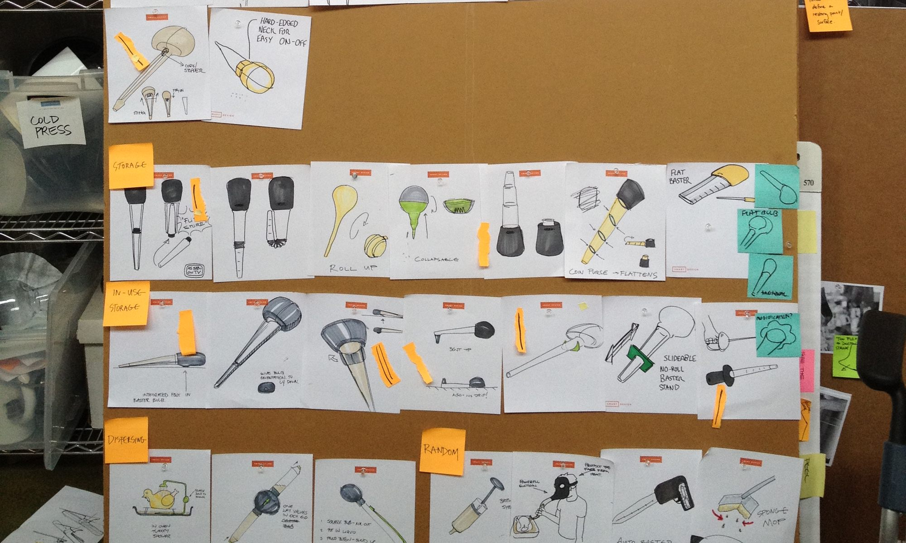
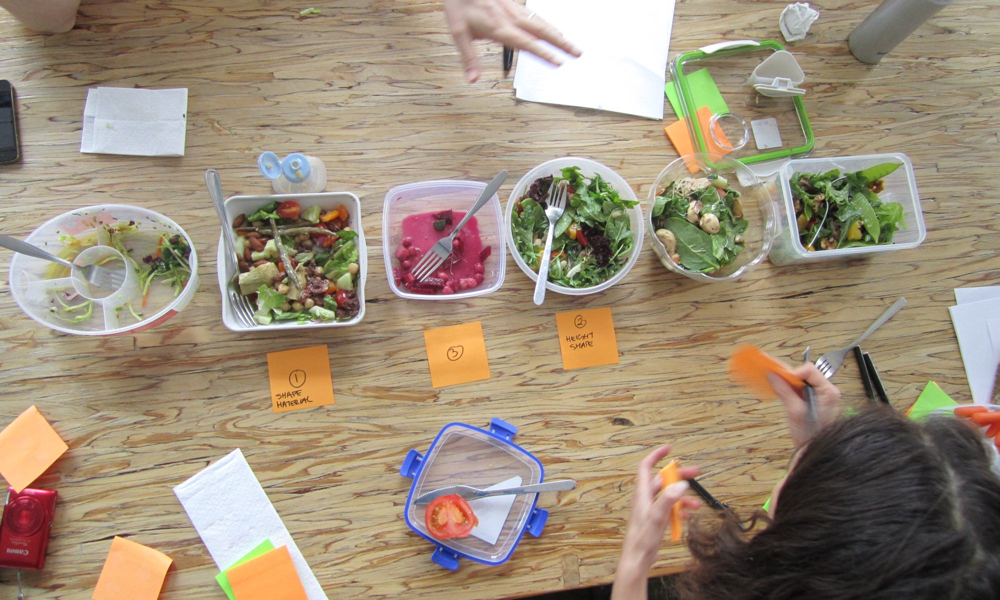

###### tl;dr —

If you're not keen to hear me wax on about New York's siren call and my introductory experiences to Real Design Work, here's a brief listing of products and experiences I've built/contributed to while working at Smart Design:

1. OXO — [Angled Baster](https://www.oxo.com/angled-baster-with-cleaning-brush-380)
2. OXO — [Delicate Duster](https://www.oxo.com/microfiber-delicate-duster)
3. OXO — [2-in-1 Salad Servers](https://www.oxo.com/2-in-1-salad-servers#green)
4. Shift — [A zine, event, blog, and website collaboration between friends.](#)

###### Introduction —

If you inspect the image above very carefully, you might recognize a piece of New York City that I had grown very close with in the summer of 2012.

What you see above is my after-the-fact rendition of Ludlow and Delancy streets, in the Lower East Side. This was where I lived while working at [Smart Design](http://smartdesignworldwide.com/).

