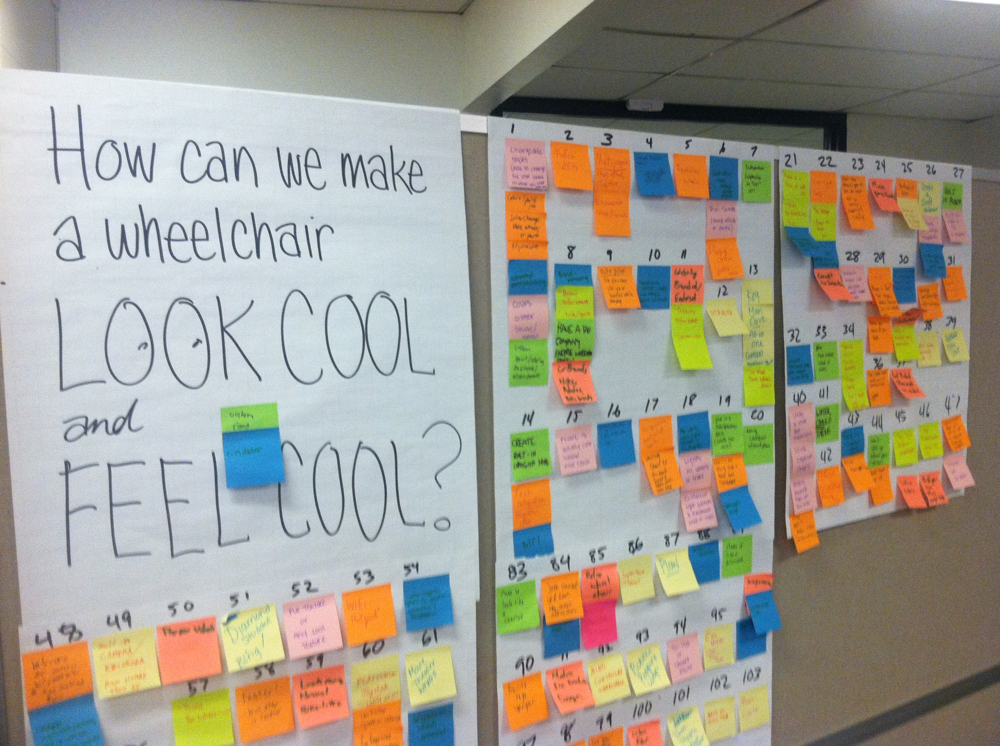

Consider the image below:

As a team, it was the sight of this particular poster and collection of Post-Its that drove us, at that moment, to collectively utter “Fuck this!” and proceed to ignore the prompts regarding wheelchair *coolness* — but I'm getting ahead of myself here. Let me explain!

###### Introduction, Project Context —

When Alban, Kim, Jennifer, and myself were asked to ‘Redesign Mobility for People in Wheelchairs’, we didn't expect to redesign the act of urination. Due to developments in our research, we took a product development path that made the most sense at the time — As a concept, we had realized that mobility didn't need to be taken so literally as to translate to "The act of locomoting oneself"; there are an incredible array of physical and mental states that contribute to a person's mobility throughout society, throughout life, etc.

When you think of having to live out your life in a wheelchair indefinitely, how do you expect it to feel?

###### Research —

We heavily utilized the model of research and insights gathering that was pioneered by IDEO. This process involved deep interaction with our various stakeholders, each of whom had lifetimes worth of experience and knowledge for us to consider and learn from.

A huge component of our research practice was constant evaluation of the process itself, and we took time each week to reflect on our learnings and ask ourselves, "Are we converging on data that's helping us understand more about the people we're designing for? Are we casting our *divergent* research nets out in appropriate places?"

One of the first no-brainer tasks for us was to get ahold of wheelchair, and live out as much as possible the experience of being bound to a wheelchair in day-to-day living.

###### Development —

There came a time when we had learned more than our collective brains could handle, and it came down to chipping away at the many ideas we're generated while researching, and building up and fusing some of the more promising ideas.

###### Engineering —

The engineering of the casing's internal and external structures occurred in tandem, with Alban providing insights into what was possible given material constraints (such as body-safe plastics).

<iframe width="100%" height="500px" src="https://sketchfab.com/models/8efc4c6d1f29479d8d4615addd0f5268/embed?autospin=0.2" frameborder="0" allowfullscreen mozallowfullscreen="true" webkitallowfullscreen="true" onmousewheel=""></iframe>

<iframe width="100%" height="500px" src="https://sketchfab.com/models/a275a1e954e847f096a2d62fd033bbf6/embed?autospin=0.2&amp;camera=0" frameborder="0" allowfullscreen mozallowfullscreen="true" webkitallowfullscreen="true" onmousewheel=""></iframe>
